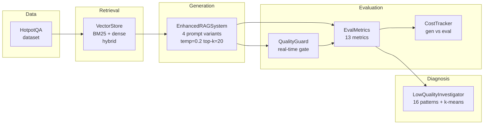

# LLM Evaluation Framework

**A provider-agnostic RAG evaluation framework benchmarked on HotpotQA.**

> Plug in any OpenAI-compatible LLM (OpenAI, Azure OpenAI, Ollama, Groq, Together AI, LM Studio) and run a rigorous, reproducible evaluation of your RAG pipeline — 13 metrics, multi-prompt comparison, failure diagnosis, and cost tracking included.

---

## Why This Framework

Most RAG evaluation toolkits answer one question: *"Is the answer correct?"*

This framework answers five:

| Question | How |
|---|---|
| Is the answer **correct**? | F1, exact match, ROUGE-L |
| Is it **grounded** in the retrieved documents? | Embedding MiniMax similarity |
| Does it **cover** the key information? | 2-tier completeness cascade |
| Does it **faithfully** represent the context? | RAGAS LLM-as-judge |
| What does it **cost** to run and to monitor? | Separated generation vs evaluation cost |

The completeness cascade and the cost separation are the novel contributions — see [Design Decisions](#design-decisions) below.

---

## Pipeline



---

## 13 Evaluation Metrics

| # | Metric | Method | Cost |
|---|--------|--------|------|
| 1 | **Exact Match** | Token normalization | Free |
| 2 | **F1 Score** | Bag-of-words overlap + partial match | Free |
| 3 | **Contains Match** | Gold answer substring in prediction | Free |
| 4 | **ROUGE-L** | Longest common subsequence | Free |
| 5 | **Answer Relevance** | cosine\_sim(answer, question) | Embedding |
| 6 | **Context Relevance** | cosine\_sim(context, question) | Embedding |
| 7 | **Groundedness** | MiniMax avg\_i max\_j sim(ans\_sent\_i, ctx\_sent\_j) | Embedding |
| 8 | **RAGAS Faithfulness** | Atomic claim extraction → LLM entailment check | LLM |
| 9 | **Completeness** | 2-tier cascade (see below) | Embedding + conditional LLM |
| 10 | **Conciseness** | Length penalty vs question length | Free |
| 11 | **Refusal Detection** | Phrase-pattern regex | Free |
| 12 | **SNR** | Ratio of context-grounded tokens | Free |
| 13 | **Quality Score** | Weighted composite (configurable weights) | — |

---

## Completeness Cascade

Completeness is the hardest metric to compute reliably. A single embedding score produces systematic false positives when:
- The answer and context share vocabulary without factual overlap
- The answer is very short but the context is rich (short answers need a different lens)

The cascade addresses this with a **trigger-on-demand** design:

```
Every answer
    │
    ▼
Tier 1 — Question-Filtered Context Coverage  (embedding, always runs)
    │  Filter context by cosine similarity to the question
    │  Score = avg_i max_j sim(relevant_ctx_i, answer_sent_j)
    │
    ├── Tier B trigger: |completeness − groundedness| > 0.3
    │                   |completeness − faithfulness| > 0.3
    │   (Cross-metric disagreement = embedding score may be unreliable)
    │
    ├── Tier C trigger: answer < N words AND ≥ M relevant context sentences
    │   (Short answer over rich context = most prone to false positives)
    │
    └── If NO trigger → use Tier 1 score   ($0.00 extra)
        If trigger fires →
            ▼
        Tier 2 — LLM-as-judge  (conditional, overrides Tier 1)
            Structured prompt: Score 0.0–1.0 + one-sentence reason
            max_tokens=80 to minimise cost
            Full audit trail per case
```

**In practice**, Tier 2 fires on ~20% of answers. The remaining 80% pay only the embedding cost of Tier 1.

---

## Multi-Prompt Comparison

Every question is evaluated across four prompt strategies simultaneously:

| Variant | Design intent | Expected F1 | Best for |
|---------|---------------|-------------|----------|
| `baseline` | Minimal instruction — natural LLM behaviour | 0.40–0.60 | Benchmarking defaults |
| `concise` | Maximum precision, minimal tokens | 0.70–0.80 | APIs, cost-sensitive apps |
| `detailed` | Comprehensive, self-contained answers | 0.60–0.75 | Support, education |
| `citation` | Attribution-enforced, compliance-ready | 0.70–0.80 | Legal, medical, finance |

---

## Failure Diagnosis

Low-quality answers are automatically classified by a 3-layer investigator:

**Layer 1 — 16 rule-based patterns** (runs on all flagged answers):

| Pattern | Signature | Diagnosis |
|---------|-----------|-----------|
| P1 | High F1 + Low Groundedness | Hallucinated details |
| P2 | Low F1 + High Groundedness | Verbose / off-target |
| P4 | Low Context Rel + Low Groundedness | Retrieval failure |
| P5 | High Context Rel + Low Answer Rel | Generation failure |
| P7 | Low F1 + Low Groundedness + Low Faithfulness | Hallucination (non-refusal) |
| P9 | Refusal + Low Context Rel | Retrieval-driven refusal |
| P10 | Refusal + High Context Rel | Over-conservative model |
| P13 | Cascade escalated + still low | Cascade unable to rescue |
| … | … | … |

**Layer 2 — k-means clustering** (UNK cases only): Groups unclassified failures by metric similarity for human review. Cluster centroids are surfaced as candidates for new rule-based patterns.

**Layer 3 — Human review exports**: Cluster representatives exported as markdown for reviewer annotation.

---

## Cost Separation

The framework tracks two cost layers independently:

```
GENERATION COST  — what your RAG system costs in production
  LLM answer generation (prompt + context + answer tokens)

EVALUATION COST  — what this monitoring framework adds
  Embedding  : retrieval query, completeness Tier 1, groundedness
  LLM judge  : RAGAS faithfulness, completeness Tier 2
```

Sample output (2,000 questions, 4 prompt variants):

```
GENERATION COSTS (production):
  llm_answer_generation          $0.2100  ($0.000105/q)

EVALUATION COSTS (framework):
  embedding_retrieval            $0.0002  ($0.000000/q)
  embedding_completeness         $0.0008  ($0.000000/q)
  llm_judge_faithfulness         $0.0420  ($0.000021/q)
  llm_judge_completeness         $0.0084  ($0.000004/q)   ← only 20% of queries
  ─────────────────────────────────────────────────────
  Evaluation overhead            16.1% of total
```

---

## Design Decisions

**Temperature 0.2, not 1.0** — HotpotQA is a factoid benchmark. Deterministic generation produced measurably higher F1 and faithfulness. Temperature 1.0 was the single largest source of score variance in baseline experiments.

**Top-K 20, not 5** — HotpotQA multi-hop questions require evidence from 2+ documents. K=5 caused frequent retrieval misses; K=20 with hybrid re-ranking captures both evidence documents reliably.

**Hybrid retrieval (BM25 + dense), not dense-only** — BM25 catches exact entity matches (person names, dates, locations) that semantic embeddings sometimes miss. The 60/40 semantic/keyword split was tuned empirically on HotpotQA dev set.

**Completeness cascade, not a single score** — A single embedding completeness score is unreliable for short answers and fails silently when context and answer share vocabulary without factual agreement. The cascade triggers LLM verification only when the evidence suggests the embedding score is wrong, keeping per-query LLM overhead at ~$0.000004.

**QualityGuard runs before cost tracking** — Real-time quality gates catch failures before they skew aggregate metrics. A hallucinated answer that passes F1 (because the LLM correctly guessed the answer from parametric knowledge) is still flagged as ungrounded.

---

## Limitations

- **LLM-as-judge bias**: RAGAS faithfulness and completeness Tier 2 use the same model that generated the answer. Self-evaluation introduces a bias toward higher scores on confident (but wrong) answers. A separate judge model is preferable when budget allows.
- **HotpotQA scope**: The framework is designed for extractive/factoid QA. For generative tasks (summarisation, creative writing) the F1 and exact match metrics are not meaningful; faithfulness and completeness remain applicable.
- **Local embedding quality**: `EMBEDDING_CHOICE=local` (sentence-transformers all-mpnet-base-v2, 768 dims) produces ~10% lower groundedness and completeness scores than API embeddings. Scores are not comparable across embedding modes.
- **BM25 on tokenised text**: BM25 does not handle morphological variation (run/runs/running). For non-English corpora, replace the whitespace tokeniser with a language-appropriate tokeniser.
- **No async execution**: The evaluation loop is synchronous. For large corpora (>10k questions), parallelise across questions at the process level, not within the notebook.

---

## Quickstart

### 1. Install dependencies

```bash
git clone https://github.com/YOUR_USERNAME/llm-eval-framework
cd llm-eval-framework
pip install -r requirements.txt
python -m nltk.downloader punkt wordnet
```

### 2. Configure your LLM provider

```bash
cp .env.example .env
# Uncomment the section for your provider and fill in your credentials
```

The provider is **auto-detected** from `OPENAI_API_VERSION`:
- **Set** → Azure OpenAI (`AzureOpenAI` client)
- **Blank** → OpenAI direct or any compatible endpoint (`OpenAI` client)

See [docs/provider-setup.md](docs/provider-setup.md) for step-by-step instructions, differences between providers, and troubleshooting.

### 3. Download HotpotQA data

```bash
mkdir -p data
# Download hotpot_train_v1.1.json from https://hotpotqa.github.io/
# Set HOTPOTQA_DATA_PATH=./data/hotpot_train_v1.1.json in your .env
```

### 4. Run the notebook

```bash
jupyter notebook notebooks/rag_eval_hotpotqa.ipynb
```

Run cells in order. The notebook is checkpointed — safe to interrupt and resume.

---

## Repo Structure

```
llm-eval-framework/
├── README.md
├── requirements.txt
├── .env.example           ← Copy to .env and fill in your credentials
├── .gitignore
│
├── notebooks/
│   └── rag_eval_hotpotqa.ipynb   ← Main evaluation notebook
│
├── src/                           ← Importable Python modules
│   ├── config.py                  ← All configuration, reads from .env
│   ├── metrics.py                 ← 13 evaluation metrics (EvalMetrics class)
│   ├── cost_tracker.py            ← Generation vs evaluation cost separation
│   ├── quality_guard.py           ← Real-time embedding-based quality gate
│   ├── vector_store.py            ← BM25 + dense hybrid retrieval
│   └── rag_system.py              ← Answer generation with quality gates
│
├── docs/
│   └── provider-setup.md          ← Step-by-step setup for Azure, OpenAI, Ollama, Groq
│
├── outputs/                       ← Evaluation results (gitignored)
└── checkpoints/                   ← Vector store + eval checkpoints (gitignored)
```

---

## Provider Compatibility

The framework auto-detects your provider from `.env` — no code changes required.

| `OPENAI_API_VERSION` | Provider | SDK client |
|---|---|---|
| Set (e.g. `2025-04-01-preview`) | Azure OpenAI | `openai.AzureOpenAI` |
| Blank | OpenAI / Ollama / Groq / etc. | `openai.OpenAI` |

**Supported providers:**

| Provider | `OPENAI_BASE_URL` | Notes |
|---|---|---|
| **Azure OpenAI** | `https://<resource>.openai.azure.com` | Set `OPENAI_API_VERSION` |
| **OpenAI (direct)** | `https://api.openai.com/v1` | — |
| **Ollama** (local) | `http://localhost:11434/v1` | Set `EMBEDDING_CHOICE=local` |
| **Groq** | `https://api.groq.com/openai/v1` | — |
| **Together AI** | `https://api.together.xyz/v1` | — |
| **LM Studio** | `http://localhost:1234/v1` | — |

See [docs/provider-setup.md](docs/provider-setup.md) for step-by-step setup, Azure vs OpenAI differences, and troubleshooting.

---

## Citation

If you use this framework in your work, please cite the HotpotQA benchmark:

```
Yang, Z. et al. (2018). HotpotQA: A Dataset for Diverse, Explainable
Multi-hop Question Answering. EMNLP 2018.
```

And the RAGAS faithfulness metric:

```
Es, S. et al. (2023). RAGAS: Automated Evaluation of Retrieval Augmented
Generation. arXiv:2309.15217.
```
