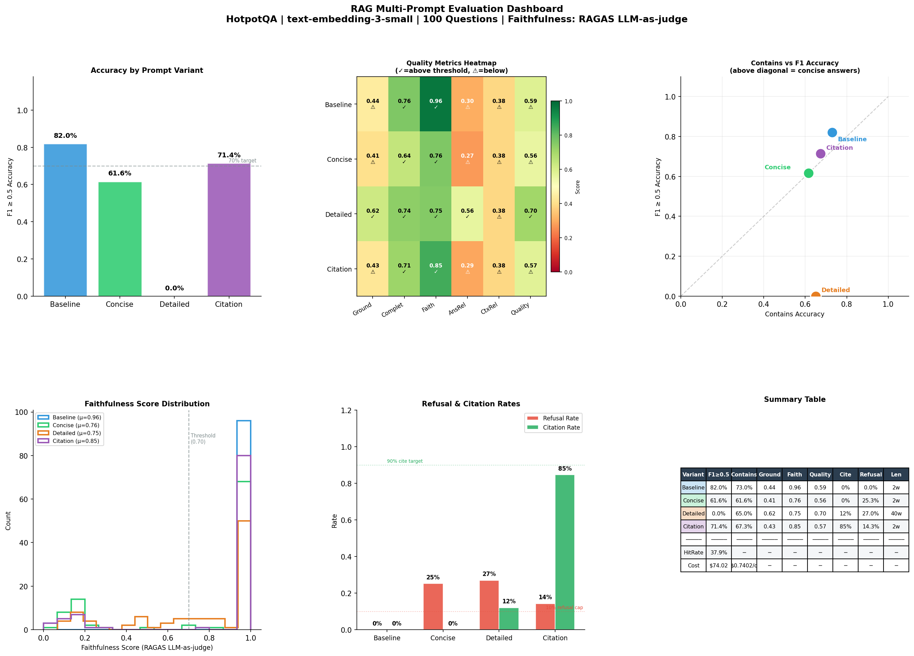
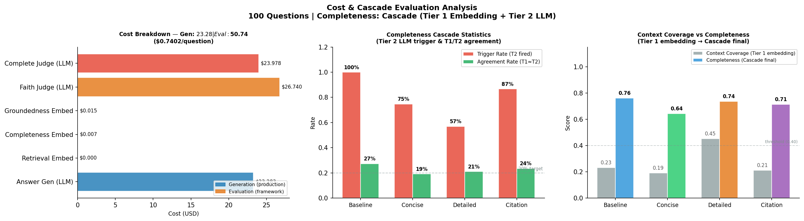
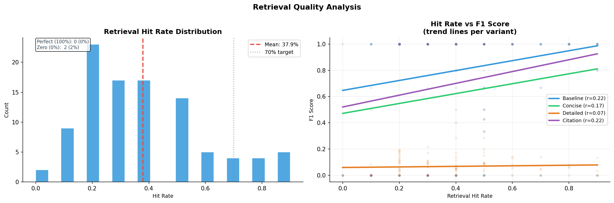

# LLM Evaluation Framework

<div align="center">

**A provider-agnostic RAG evaluation framework benchmarked on HotpotQA**

[](https://colab.research.google.com/github/minw0607/rag_eval_framework/blob/main/notebooks/rag_eval_hotpotqa_demo.ipynb)
[](LICENSE)
[](https://www.python.org/downloads/)
[](docs/provider-setup.md)
[](docs/provider-setup.md)
[](docs/provider-setup.md)

*Plug in any OpenAI-compatible LLM and run a rigorous, reproducible evaluation of your RAG pipeline —*  
*13 metrics · multi-prompt comparison · failure diagnosis · cost tracking · auto-generated audit report*

</div>

> **Status:** Independent personal research project

---

## Why This Framework

Most RAG evaluation toolkits answer one question: *"Is the answer correct?"*

This framework answers **five** — and generates an audit-ready report that tells you *why*:

| Question | How |
|---|---|
| Is the answer **correct**? | F1, exact match, ROUGE-L |
| Is it **grounded** in retrieved documents? | MiniMax embedding similarity |
| Does it **cover** the key information? | 2-tier completeness cascade |
| Does it **faithfully** represent the context? | RAGAS LLM-as-judge |
| What does it **cost** to run and monitor? | Generation vs. evaluation cost separation |

> **Novel contributions:** The completeness cascade and the generation/evaluation cost separation are purpose-built for production RAG monitoring — not found in standard evaluation toolkits.

---

## At a Glance

```
┌─────────────────────────────────────────────────────────────────────────────┐
│                         RAG Evaluation Pipeline                             │
├──────────┬────────────────┬─────────────────────────┬───────────────────────┤
│  DATA    │   RETRIEVAL    │      GENERATION          │     EVALUATION        │
│          │                │                          │                       │
│ HotpotQA │ Hybrid BM25 +  │ 4 prompt variants        │ 13 metrics            │
│ multi-hop│ dense (60/40)  │ temp=0.2  top-k=20       │ QualityGuard gate     │
│ benchmark│ top-k=20       │ baseline / concise /     │ Failure investigator  │
│          │                │ detailed / citation      │ Cost tracker          │
│          │                │                          │ Audit report          │
└──────────┴────────────────┴─────────────────────────┴───────────────────────┘
```

---

## Sample Results

*Generated from a 100-question HotpotQA run (`text-embedding-3-small`, RAGAS LLM-as-judge). All charts produced automatically by the framework.*

### Multi-Prompt Evaluation Dashboard

Accuracy by variant, quality-metric heatmap, faithfulness distribution, and refusal/citation rates — at a glance across all four prompt strategies.



### Cost & Completeness Cascade

Generation vs. evaluation cost separation (left), the ~20% Tier-2 LLM trigger rate of the completeness cascade (centre), and how the cascade lifts embedding-only scores (right).



### Retrieval Quality

Hit-rate distribution against the 70% target, and the correlation between retrieval hit rate and answer F1 per variant.



### 📄 Sample Audit Report

A full auto-generated audit report from the same run is included in the repo:

- **[View the Markdown report](reports/multi_prompt_eval_results_100_report.md)** — renders directly on GitHub
- **[Download the PDF report](reports/multi_prompt_eval_results_100_report.pdf)** — print-ready, ~1.5 MB

The report walks through all 12 sections: executive summary, evaluation scope, metric definitions, per-category results with observation tables, failure diagnosis, cost analysis, and reproduction steps.

---

## 13 Evaluation Metrics

Metrics are grouped into three categories that map directly to the report sections:

### 🎯 Correctness

| # | Metric | Method | Cost |
|---|--------|--------|------|
| 1 | **Exact Match** | Token normalization | Free |
| 2 | **F1 Score** | Bag-of-words overlap + partial match bonus | Free |
| 3 | **Contains Match** | Gold answer substring in prediction | Free |
| 4 | **ROUGE-L** | Longest common subsequence | Free |

### 📊 Answer Quality

| # | Metric | Method | Cost |
|---|--------|--------|------|
| 5 | **Answer Relevance** | cosine_sim(answer, question) | Embedding |
| 6 | **Completeness** | 2-tier cascade — see below | Embedding + conditional LLM |
| 7 | **Conciseness** | Length penalty vs. question length | Free |
| 8 | **Refusal Detection** | Phrase-pattern regex | Free |
| 9 | **Quality Score** | Weighted composite (configurable weights) | — |

### 🔗 Attribution & Retrieval

| # | Metric | Method | Cost |
|---|--------|--------|------|
| 10 | **Context Relevance** | cosine_sim(context, question) | Embedding |
| 11 | **Groundedness** | MiniMax avg_i max_j sim(ans_sent_i, ctx_sent_j) | Embedding |
| 12 | **RAGAS Faithfulness** | Atomic claim extraction → LLM entailment check | LLM |
| 13 | **SNR** | Ratio of context-grounded tokens | Free |

---

## Completeness Cascade

Completeness is the hardest metric to compute reliably. A single embedding score produces systematic false positives when answers are short or share vocabulary with context without factual agreement. The cascade fixes this with a **trigger-on-demand** design:

```
Every answer
    │
    ▼
Tier 1 — Question-Filtered Context Coverage  (embedding, always runs, free-ish)
    │  Filter context sentences by cosine similarity to the question
    │  Score = avg_i max_j sim(relevant_ctx_i, answer_sent_j)
    │
    ├── Trigger B: |completeness_T1 − groundedness| > 0.3   (cross-metric disagreement;
    │              completeness_T1 = Tier 1 embedding score computed just above)
    ├── Trigger C: answer < N words AND ≥ M relevant context sentences (short answer)
    │
    └── No trigger → use Tier 1 score (zero extra cost)
        Trigger fires →
            ▼
        Tier 2 — LLM-as-judge  (conditional, ~20% of queries)
            Structured prompt: score 0.0–1.0 + one-sentence reason
            max_tokens=80 · full audit trail per case
```

**In practice:** Tier 2 fires on ~20% of answers, keeping per-query LLM overhead at ~$0.000004.

---

## Multi-Prompt Comparison

Every question is evaluated across **four prompt strategies simultaneously**:

| Variant | Design intent | Expected F1 | Best for |
|---------|---------------|-------------|----------|
| `baseline` | Minimal instruction — natural LLM behaviour | 0.40–0.60 | Benchmarking defaults |
| `concise` | Maximum precision, minimal tokens | 0.70–0.80 | APIs, cost-sensitive apps |
| `detailed` | Comprehensive, self-contained answers | 0.60–0.75 | Support, education |
| `citation` | Attribution-enforced, compliance-ready | 0.70–0.80 | Legal, medical, finance |

---

## Auto-Generated Audit Report

After evaluation, the framework generates a **structured Markdown report** in `reports/`:

```
reports/multi_prompt_eval_results_500_report.md
│
├── Executive Summary         — LLM-consolidated cross-section findings with causal chains
├── § 2  Evaluation Scope     — System architecture, test data, coverage, regulatory alignment
├── § 3  Evaluation Approach  — Metrics, sampling, completeness cascade, LLM judge policy
├── § 4  Correctness          — F1/EM/ROUGE across variants + observations table
├── § 5  Answer Quality       — Completeness, conciseness, refusals + observations table
├── § 6  Attribution          — Groundedness, faithfulness, SNR + observations table
├── § 7  Retrieval Quality    — Context relevance, hit rates + observations table
├── § 8  Cost Analysis        — Generation vs. evaluation cost breakdown
├── § 9  Failure Diagnosis    — 16 patterns + k-means clustering of unclassified failures
├── §10  Cross-Section Analysis
├── §11  Conclusions & Recommendations
└── §12  Reproduction Steps
```

Each LLM-generated section carries an **AI disclosure notice** and is clearly separated from deterministic (audit-safe) observations. The report is designed to be submitted to model risk management review with SR 11-7 / SR 26-02 and NIST AI RMF cross-references in §2.4.

---

## Failure Diagnosis

Low-quality answers are automatically classified by a **3-layer investigator**:

**Layer 1 — 16 rule-based patterns** (runs on all flagged answers):

| Pattern | Metric signature | Diagnosis |
|---------|-----------------|-----------|
| P1 | High F1 + Low Groundedness | Hallucinated details |
| P2 | Low F1 + High Groundedness | Verbose / off-target |
| P4 | Low Context Rel + Low Groundedness | Retrieval failure |
| P5 | High Context Rel + Low Answer Rel | Generation failure |
| P7 | Low F1 + Low Groundedness + Low Faithfulness | Hallucination (non-refusal) |
| P9 | Refusal + Low Context Rel | Retrieval-driven refusal |
| P10 | Refusal + High Context Rel | Over-conservative model |
| P13 | Cascade escalated + still low | Cascade cannot rescue |
| … | … | … |

**Layer 2 — k-means clustering** (UNK cases only): groups unclassified failures by metric similarity; cluster centroids surface as candidates for new rule-based patterns.

**Layer 3 — Human review exports**: cluster representatives exported as Markdown for reviewer annotation.

---

## Cost Separation

The framework tracks two cost layers independently so you can answer: *"How much does my RAG pipeline cost in production, and how much does this monitoring add?"*

```
GENERATION COST  — what your RAG system costs in production
  LLM answer generation (prompt + context + answer tokens)

EVALUATION COST  — what this monitoring framework adds
  Embedding  : retrieval query, completeness Tier 1, groundedness
  LLM judge  : RAGAS faithfulness, completeness Tier 2 (~20% of queries)
```

Sample output (500 questions × 4 prompt variants = 2,000 answers):

```
GENERATION COSTS (production):
  llm_answer_generation          $0.2100  ($0.000105/q)

EVALUATION COSTS (framework):
  embedding_retrieval            $0.0002  ($0.000000/q)
  embedding_completeness         $0.0008  ($0.000000/q)
  llm_judge_faithfulness         $0.0420  ($0.000021/q)
  llm_judge_completeness         $0.0084  ($0.000004/q)  ← only ~20% of queries
  ─────────────────────────────────────────────────────
  Evaluation overhead            16.1% of total
```

---

## Design Decisions

**Temperature 0.2, not 1.0** — HotpotQA is a factoid benchmark. Deterministic generation produces measurably higher F1 and faithfulness. Temperature 1.0 was the single largest source of score variance in baseline experiments.

**Top-K 20, not 5** — HotpotQA multi-hop questions require evidence from 2+ documents. K=5 caused frequent retrieval misses; K=20 with hybrid re-ranking captures both gold documents reliably.

**Hybrid retrieval (BM25 + dense, 60/40), not dense-only** — BM25 catches exact entity matches (names, dates, locations) that semantic embeddings sometimes miss. The split was tuned empirically on the HotpotQA dev set.

**Completeness cascade, not a single score** — A single embedding completeness score fails silently for short answers and when context shares vocabulary without factual agreement. The cascade triggers LLM verification only when evidence suggests the embedding score is unreliable.

**QualityGuard runs before cost tracking** — The real-time gate catches failures before they skew aggregate metrics. Answers that pass F1 by coincidence (parametric LLM knowledge, not retrieval) are still flagged as ungrounded.

---

## Limitations

- **LLM-as-judge bias**: RAGAS faithfulness and completeness Tier 2 use the same model that generated the answer. Self-evaluation biases toward higher scores on confident-but-wrong answers. A separate judge model is preferable when budget allows.
- **HotpotQA scope**: Optimised for extractive/factoid QA. For generative tasks (summarisation, creative writing), F1 and exact match are not meaningful — faithfulness and completeness remain applicable.
- **Local embedding quality**: `EMBEDDING_CHOICE=local` (all-mpnet-base-v2, 768 dims) produces ~10% lower groundedness and completeness scores than API embeddings. Scores are not directly comparable across embedding modes.
- **BM25 tokenisation**: BM25 does not handle morphological variation. For non-English corpora, replace the whitespace tokeniser with a language-appropriate tokeniser.
- **Synchronous execution**: The evaluation loop is single-threaded. For large corpora (>10k questions), parallelise at the process level, not within the notebook.

---

## Quickstart

### Option A — Google Colab (no local install)

> **Azure OpenAI with IP allowlisting:** Colab runs on Google Cloud — its IPs are typically not on corporate allowlists. Use Option B (local) for Azure deployments behind a firewall.

Click the **Open in Colab** badge at the top of this README. Then:

**Step 1 — Get the HotpotQA data**

Download `hotpot_train_v1.1.json` from [hotpotqa.github.io](https://hotpotqa.github.io/) (~540 MB) and upload it to your Google Drive:

```
My Drive/data/hotpot_train_v1.1.json
```

**Step 2 — Add Colab Secrets** (🔑 key icon in left sidebar → "Add new secret")

| Secret name | Example value |
|---|---|
| `OPENAI_API_KEY` | `sk-...` |
| `OPENAI_BASE_URL` | `https://api.openai.com/v1` |
| `OPENAI_API_VERSION` | `2025-04-01-preview` *(Azure only — leave blank for OpenAI)* |
| `OPENAI_GENERATION_MODEL` | `gpt-4o` |
| `OPENAI_EMBEDDING_MODEL` | `text-embedding-3-small` |
| `HOTPOTQA_DATA_PATH` | `/content/drive/MyDrive/data/hotpot_train_v1.1.json` |

Secrets are stored once in your Colab account and never appear in notebook output.

**Step 3 — Run all cells in order**

The notebook is checkpointed — safe to interrupt and resume.

---

### Option B — Local Setup

#### 1. Clone and install

```bash
git clone https://github.com/minw0607/rag_eval_framework.git
cd rag_eval_framework
pip install -r requirements.txt
python -m nltk.downloader punkt wordnet
```

#### 2. Configure your LLM provider

```bash
cp .env.example .env
# Edit .env — uncomment the section for your provider and fill in credentials
```

The provider is **auto-detected** from `OPENAI_API_VERSION`:
- **Set** (e.g. `2025-04-01-preview`) → Azure OpenAI (`AzureOpenAI` client)
- **Blank** → OpenAI direct, Ollama, Groq, or any compatible endpoint (`OpenAI` client)

See [docs/provider-setup.md](docs/provider-setup.md) for step-by-step instructions for each provider.

#### 3. Get the HotpotQA dataset

```bash
mkdir -p data
# Download hotpot_train_v1.1.json (~540 MB) from https://hotpotqa.github.io/
# Move it to data/hotpot_train_v1.1.json
# Set HOTPOTQA_DATA_PATH=./data/hotpot_train_v1.1.json in your .env
```

> **Why isn't the dataset in the repo?** At 540 MB it exceeds GitHub's 100 MB per-file limit. Download directly from the official source above.

#### 4. Vector store — build your own (recommended) or download a demo checkpoint

**Recommended — build your own:**

The notebook builds the vector store automatically on first run and caches it in `checkpoints/`. Subsequent runs load from cache instantly. This is the right path if you plan to run your own evaluation.

**Quick demo — download a pre-built checkpoint (~14 MB):**

If you just want to explore the notebook output without waiting for a build, a pre-built checkpoint (999 documents, matches the sample run in `reports/`) is hosted on Google Drive:

```bash
mkdir -p checkpoints
# Download the checkpoint:
# https://drive.google.com/uc?export=download&id=10Ii-jOFefqfOe6AVBjcTL_HotYp6H4ge
# Save it as: checkpoints/vs_999_docs_small.pkl
```

Then in your `.env` (already the default):
```
FORCE_REBUILD_VECTOR_STORE=False
```

The notebook will auto-detect and load it — no build step needed.

> **Note:** The demo checkpoint covers ~999 HotpotQA documents. For a full evaluation run, build your own vector store from the complete dataset.

#### 5. Run the notebook

```bash
jupyter notebook notebooks/rag_eval_hotpotqa_demo.ipynb
```

Run cells in order. The notebook is checkpointed — safe to interrupt and resume.

---

## Repo Structure

```
llm-eval-framework/
├── README.md
├── requirements.txt
├── .env.example                    ← Copy to .env and fill in credentials (never committed)
├── .gitignore
├── LICENSE
│
├── notebooks/
│   ├── rag_eval_hotpotqa_demo.ipynb      ← ★ Start here — full pipeline, interactive
│   ├── rag_eval_hotpotqa_full.ipynb      ← Production run (500+ questions)
│   └── rag_eval_hotpotqa_concise.ipynb   ← Compact version, no markdown narrative
│
├── src/                                   ← Importable Python modules
│   ├── config.py                          ← All configuration, reads from .env
│   ├── data_loader.py                     ← HotpotQA loader, question-centric sampling
│   ├── vector_store.py                    ← BM25 + dense hybrid retrieval
│   ├── rag_system.py                      ← Answer generation with 4 prompt variants
│   ├── metrics.py                         ← 13 evaluation metrics (EvalMetrics class)
│   ├── quality_guard.py                   ← Real-time embedding-based quality gate
│   ├── evaluation_runner.py               ← Orchestrates evaluation loop
│   ├── cost_tracker.py                    ← Generation vs. evaluation cost separation
│   ├── investigator.py                    ← Failure diagnosis (16 patterns + k-means)
│   ├── visualizer.py                      ← Dashboard, retrieval, and cascade charts
│   ├── report_generator.py                ← Auto-generates structured audit report
│   └── preflight.py                       ← Dependency and credential checks
│
├── docs/
│   └── provider-setup.md                  ← Step-by-step setup for Azure, OpenAI, Ollama, Groq
│
├── assets/                                ← Sample visualizations shown in this README
│
├── reports/                               ← Audit reports (sample run committed; fresh runs here)
│   ├── multi_prompt_eval_results_100_report.md    ← ★ Sample report (rendered above)
│   └── multi_prompt_eval_results_100_report.pdf   ← ★ Print-ready PDF
│
├── outputs/                               ← Evaluation outputs (gitignored)
│   ├── multi_prompt_eval_results_*.json   ← Raw results
│   ├── evaluation_dashboard*.png
│   ├── retrieval_analysis*.png
│   ├── cost_cascade_analysis*.png
│   └── low_quality_analysis*/             ← Failure diagnosis exports
│
├── checkpoints/                           ← Vector store checkpoints (gitignored)
│   └── vs_*.pkl                           ← Auto-loaded on restart; set FORCE_REBUILD=False
│
└── data/                                  ← Dataset files (gitignored — download separately)
    └── hotpot_train_v1.1.json
```

---

## Provider Compatibility

The framework auto-detects your provider from `.env` — no code changes required.

| `OPENAI_API_VERSION` | Provider | SDK client |
|---|---|---|
| Set (e.g. `2025-04-01-preview`) | Azure OpenAI | `openai.AzureOpenAI` |
| Blank | OpenAI / Ollama / Groq / etc. | `openai.OpenAI` |

**Supported providers:**

| Provider | `OPENAI_BASE_URL` | Notes |
|---|---|---|
| **Azure OpenAI** | `https://<resource>.openai.azure.com` | Set `OPENAI_API_VERSION` |
| **OpenAI (direct)** | `https://api.openai.com/v1` | Default |
| **Ollama** (local) | `http://localhost:11434/v1` | Set `EMBEDDING_CHOICE=local` |
| **Groq** | `https://api.groq.com/openai/v1` | — |
| **Together AI** | `https://api.together.xyz/v1` | — |
| **LM Studio** | `http://localhost:1234/v1` | — |

See [docs/provider-setup.md](docs/provider-setup.md) for step-by-step setup, Azure vs. OpenAI differences, and troubleshooting.

---

## Regulatory Alignment

The evaluation design maps directly to model risk management frameworks:

| Framework | Requirement | How This Framework Addresses It |
|---|---|---|
| **SR 26-02** §4.2 | Quantitative performance benchmarking | 13 metrics across correctness, quality, attribution |
| **SR 26-02** §5.1 | Outcome monitoring and bias testing | QualityGuard gate + failure diagnosis |
| **NIST AI RMF** MEASURE 2.5 | Ongoing AI output monitoring | Real-time quality gate with per-question audit trail |
| **NIST AI RMF** GOVERN 1.7 | Transparency and explainability | AI disclosure on every LLM-generated block |

---

## Disclaimer

This repository is an independent personal project created outside of my employment using my own time and equipment.

Unless explicitly stated otherwise, the code, notebooks, demonstrations, analyses, and documentation in this repository are developed independently from publicly available research papers, technical documentation, regulations, and other public sources. They do not rely on, incorporate, or disclose any confidential, proprietary, non-public, or client information obtained through my employment or professional engagements.

The views, designs, implementations, and conclusions expressed in this repository are solely my own and do not represent the views of any employer, client, or affiliated organization.

This repository is provided for research and educational purposes only.

---

## Citation

If you use this framework in your work, please cite the HotpotQA benchmark:

```bibtex
@inproceedings{yang2018hotpotqa,
  title={HotpotQA: A Dataset for Diverse, Explainable Multi-hop Question Answering},
  author={Yang, Zhilin and others},
  booktitle={EMNLP},
  year={2018}
}
```

And the RAGAS faithfulness metric:

```bibtex
@article{es2023ragas,
  title={RAGAS: Automated Evaluation of Retrieval Augmented Generation},
  author={Es, Shahul and others},
  journal={arXiv:2309.15217},
  year={2023}
}
```

---

<div align="center">

Made with ❤️ for rigorous, reproducible RAG evaluation  
[Open an issue](https://github.com/minw0607/rag_eval_framework/issues) · [Provider setup guide](docs/provider-setup.md)

</div>
